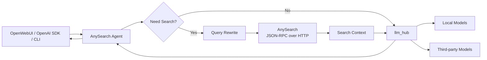

# AnySearch Agent

一个面向**联网问答 / 内网自托管模型场景**的轻量级 Search Agent。

项目通过 AnySearch 获取网页搜索结果，通过自建 `llm_hub` 统一调用本地或第三方大模型，并对外提供 OpenAI-compatible API，方便接入 OpenWebUI 等前端。

> 这是一个工程实践项目，重点不是“再做一个聊天机器人”，而是把 **是否搜索、Query Rewrite、网页检索、LLM 总结、流式输出、来源展示和模型降级** 串成一条可复用链路。

---

## 1. 项目背景

普通大模型无法可靠回答最新价格、版本、新闻、政策等实时问题；而“所有问题都联网搜索”又会增加延迟和不必要的调用成本。

因此本项目实现了一条简单、可解释的搜索增强流程：

1. 先判断当前问题是否需要联网；
2. 对多轮追问进行 Query Rewrite，补全指代和上下文；
3. 调用 AnySearch 获取搜索结果；
4. 将搜索结果整理后交给 `llm_hub` 中的模型总结；
5. 通过 SSE / OpenAI-compatible API 流式返回回答与来源。

---

## 2. 系统架构



核心链路：

```text
User Query
   ↓
Search Decision
   ├─ Keyword fast path
   └─ LLM Judge
   ↓
Contextual Query Rewrite (multi-turn)
   ↓
AnySearch
   ↓
Structured Search Results
   ↓
llm_hub
   ↓
Streaming Answer + Sources
```

---

## 3. 核心能力

### 3.1 搜索意图判断

不是所有问题都直接联网。

项目采用“**规则快速路径 + LLM Judge**”的混合策略：

- 对“最新、今天、价格、版本、新闻、政策、报错”等明显时效问题直接搜索；
- 对普通概念、写作、翻译、基础编程等问题直接交给模型回答；
- 对无法由规则判断的问题，再调用轻量模型进行 YES / NO 判断；
- Judge 调用异常时默认 fallback 到搜索，优先保证事实问题的可回答性。

这样可以在搜索质量和响应延迟之间做一个简单平衡。

### 3.2 多轮 Query Rewrite

多轮对话中，用户经常会使用“它”“这个”“那它呢”等指代词。

例如：

```text
第一轮：H100 GPU 最新价格是多少？
第二轮：那它的功耗呢？
```

第二轮如果直接搜索“那它的功耗呢”，搜索引擎很难理解真实实体。

项目会结合最近的对话历史，把追问改写成可以独立搜索的查询，例如：

```text
NVIDIA H100 GPU 的功耗是多少？
```

同时加入输出校验和 fallback，避免 Rewrite 模型返回解释文字、Prompt 内容或异常结果时污染搜索 Query。

### 3.3 AnySearch HTTP / JSON-RPC 客户端

项目没有依赖 MCP SDK，而是直接通过 HTTP 调用 AnySearch 的 JSON-RPC 2.0 端点：

```text
POST https://api.anysearch.com/mcp
method: tools/call
name: search
```

搜索结果会被统一解析为：

```python
SearchResult(
    title="...",
    url="...",
    snippet="...",
    published_date="...",
)
```

同时支持内存级搜索缓存，减少短时间内重复 Query 的远程调用。

### 3.4 LLM Hub 接入

`llm_client.py` 通过 OpenAI-compatible API 调用 `llm_hub`：

```text
AnySearch Agent
      ↓
   llm_hub
      ↓
Local / Third-party Models
```

因此 Search Agent 不需要关心具体模型来自本地部署还是第三方平台，只需要传入统一的 `model` 名称。

当前代码也包含模型连接异常、503、编码异常等 fallback 处理。

### 3.5 OpenAI-compatible API

服务对外提供：

```text
GET  /v1/models
POST /v1/chat/completions
```

因此可以直接通过 OpenAI SDK 或兼容前端调用。

另外保留两个便捷接口：

```text
POST /search    # 仅搜索
POST /chat      # 搜索 + LLM 总结，SSE 输出
```

### 3.6 SSE 流式输出与来源

`/chat` 会按阶段输出不同 SSE event，例如：

```text
judge
status
sources
think
token
done
error
```

这样前端可以分别展示：

- 是否需要联网；
- 当前搜索状态；
- 搜索来源；
- 模型生成内容；
- 最终结果或错误。

`/v1/chat/completions` 则尽量保持 OpenAI Chat Completions 的调用方式，方便 OpenWebUI 等客户端直接接入。

### 3.7 缓存、Fallback 与耗时日志

服务端还包含一些面向实际使用场景的工程处理：

- 搜索结果缓存；
- 完整回答缓存；
- 模型 503 / timeout fallback；
- Judge / Rewrite 超时控制；
- First-token 相关超时处理；
- `rewrite_ms`、`judge_ms`、`search_ms` 等阶段耗时日志；
- 针对部分模型的上下文长度和历史消息裁剪。

### 3.8 图片输入兼容

`/v1/chat/completions` 还包含图片输入预处理逻辑：

- 对支持视觉能力的模型直接处理图片；
- 必要时使用视觉模型先生成图片描述；
- 缓存图片描述，供后续多轮对话继续引用图片内容。

这部分属于扩展能力，不是项目最核心的搜索链路。

---

## 4. 项目结构

```text
anysearch-agent/
├── agent.py                # 搜索判断、Query Rewrite、搜索增强主流程
├── search_client.py        # AnySearch HTTP / JSON-RPC 客户端
├── llm_client.py           # llm_hub OpenAI-compatible 客户端
├── server.py               # asyncio 服务、SSE、OpenAI-compatible API
├── app_capabilities.py     # 服务自身模型/接口能力的确定性回答
├── run.py                  # CLI / 交互模式 / 服务启动入口
├── ask.py                  # 调用示例
├── openwebui-loader.js     # OpenWebUI 兼容辅助脚本
├── .env.example            # 环境变量模板
└── pyproject.toml
```

---

## 5. 快速开始

### 5.1 环境要求

- Python >= 3.10
- 可访问的 AnySearch API
- 一个 OpenAI-compatible 的 `llm_hub`

### 5.2 安装依赖

推荐使用 `uv`：

```bash
uv sync
```

### 5.3 配置环境变量

```bash
cp .env.example .env
```

至少需要配置：

```env
ANYSEARCH_API_KEY=your-anysearch-key
LLM_HUB_BASE_URL=http://127.0.0.1:8000/v1
LLM_HUB_API_KEY=your-llm-hub-key
LLM_HUB_MODEL=your-default-model
SEARCH_DECISION_MODEL=your-judge-model
```

常用可选参数：

```env
SEARCH_MAX_RESULTS=5
SEARCH_FRESHNESS=month
SEARCH_DECISION_MODE=auto
JUDGE_TIMEOUT=30
REWRITE_TIMEOUT=30
SEARCH_CACHE_TTL=300
```

### 5.4 启动服务

```bash
uv run python run.py --serve --port 9090
```

默认监听：

```text
http://127.0.0.1:9090
```

---

## 6. 使用示例

### 6.1 仅搜索

```bash
curl -s http://127.0.0.1:9090/search \
  -H "Content-Type: application/json" \
  -d '{"query":"Claude Code 最新版本","max_results":5}'
```

### 6.2 搜索 + LLM 总结

```bash
curl -N http://127.0.0.1:9090/chat \
  -H "Content-Type: application/json" \
  -d '{"query":"Claude Code 最新版本"}'
```

### 6.3 OpenAI-compatible API

```bash
curl -N http://127.0.0.1:9090/v1/chat/completions \
  -H "Content-Type: application/json" \
  -d '{
    "model":"your-model",
    "messages":[
      {"role":"user","content":"Claude Code 最新版本是什么？"}
    ],
    "stream":true
  }'
```

### 6.4 OpenAI Python SDK

```python
from openai import OpenAI

client = OpenAI(
    base_url="http://127.0.0.1:9090/v1",
    api_key="not-needed",
)

stream = client.chat.completions.create(
    model="your-model",
    messages=[
        {"role": "user", "content": "最近有哪些新的大模型推理优化方法？"}
    ],
    stream=True,
)

for chunk in stream:
    delta = chunk.choices[0].delta
    if delta.content:
        print(delta.content, end="", flush=True)
```

---

## 7. OpenWebUI 接入

因为项目暴露 OpenAI-compatible API，所以可以将 OpenWebUI 的 OpenAI API Base URL 指向：

```text
http://<ANYSEARCH_AGENT_HOST>:9090/v1
```

模型列表可通过：

```text
GET /v1/models
```

获取。

仓库中的 `openwebui-loader.js` 用于处理部分 OpenWebUI 前端兼容需求，例如用户标识传递和旧模型配置清理；基础 API 调用并不依赖该脚本。

---

## 8. 设计取舍

### 为什么不直接让所有问题都搜索？

实时问题需要联网，但基础概念和普通聊天通常不需要。增加 Search Decision 可以减少无意义搜索和额外延迟。

### 为什么既有规则又有 LLM Judge？

纯规则快但覆盖有限；全部交给 LLM 判断又会增加延迟和不确定性。因此使用关键词处理高置信度场景，其余问题再交给 Judge。

### 为什么要做 Query Rewrite？

搜索引擎接收的是当前 Query，而多轮对话的真实语义往往依赖前文。Rewrite 的目标是把“聊天式追问”转换成“可独立搜索的问题”。

### 为什么通过 llm_hub 调模型？

这样 Search Agent 与具体 Provider 解耦。本地模型和第三方模型都可以通过同一套 OpenAI-compatible 接口接入。

---


## 9. 项目定位

这个项目主要用于学习和验证一个完整的联网 Agent 工程链路：

```text
问题理解
→ 是否搜索
→ Query Rewrite
→ Web Search
→ Context Construction
→ LLM Generation
→ Streaming
→ Sources
```

相比单纯调用搜索 API，本项目更关注**搜索什么时候发生、如何处理多轮上下文、如何统一模型调用，以及如何把整个链路做成可复用服务**。
